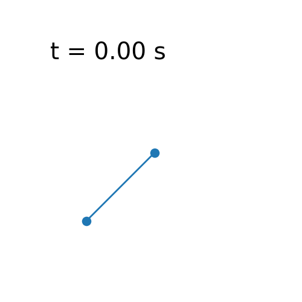
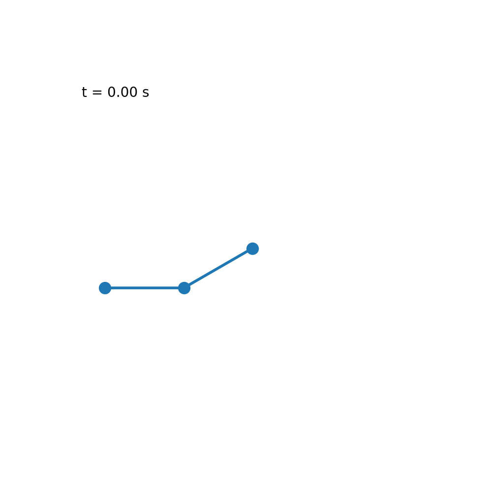
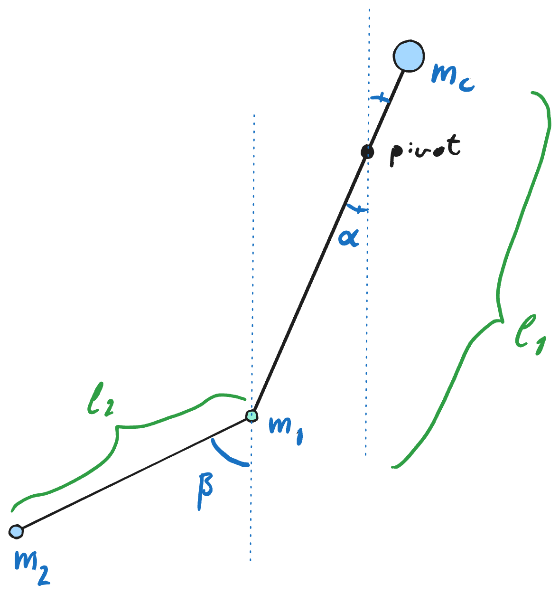

# A simple trebuchet simulator

By Harald Lykke Joakimsen (harald.l.joakimsen@uit.no)

  
  
  

## How to run
1. Clone the repository: `git clone <this repo url>`

2. Make sure you have a Python environment with the required packages installed. You can use the provided `pyproject.toml` file with a tool like [uv](https://docs.astral.sh/uv/) or install the packages manually using pip:
`pip install numpy scipy matplotlib sympy`.

3. change directory to `src/` (for relative referance to cache and figures to work): `cd src`

4. Run code:
  - With [uv](https://docs.astral.sh/uv/): `uv run trebuchet.py` etc.
  - Or run with python directly: `python3 trebuchet.py`

5. The simulation results will be saved in the `figures` folder as `trebuchet_simulation.gif` and the expressions for the double derivatives of the two angles should be printed to the console.

## Steps to create the simulator

This is a simple trebuchet simulator written in Python. The steps involved are:

1. Draw figure to define variables and parameters.
2. Use Lagrangian mechanics to derive equations of motion symbolically using SymPy.
3. Numerically solve the equations of motion using SciPy.
4. Visualize the results with Matplotlib.

## Figure

*Figure made with Excalidraw*.

## Assumptions

We assume all motion is in a plane, and that the arms are rigid bodies with uniform mass distribution. We also assume no friction or air resistance, and that the pivot points are fixed. The projectile and counter weight are treated as point masses.

## Equations of motion

The equations of motion are derived using Lagrangian mechanics. The Lagrangian is given by
$$
L = T - V
$$
where $T$ is the kinetic energy and $V$ is the potential energy of the system. The equations of motion are obtained by applying the Euler-Lagrange equations:

$$
\frac{d}{dt} \left( \frac{\partial L}{\partial \dot{q}_i} \right) - \frac{\partial L}{\partial q_i} = 0
$$

where $q_i$ are the generalized coordinates of the system. In this case, we use the angles of both arms as generalized coordinates, i.e. $q_1 = \theta_1$ and $q_2 = \theta_2$ or in vector form $\mathbf{q} = [\theta_1, \theta_2]$. The resulting equations of motion are a set of coupled second-order differential equations that can be solved numerically. If you want to see the full expressions, run `trebuchet/src/trebuchet.py` and look for the printed output. 

## Simulations

The simulations are performed using the `solve_ivp` function from SciPy. The equations of motion are converted to a system of first-order ODEs and solved with a method from the Runge-Kutta family. The results are then visualized using Matplotlib. 
The following is the result of 5 simulations with slightly different initial conditions overlaid:

Notice how the simulations look very similar to begin with, but diverge after a while. This is a hallmark of chaotic systems, where small differences in initial conditions can lead to vastly different outcomes. In this case, the simulations have slightly different initial angles for the first arm, which leads to different trajectories for the projectile.
For a simple double pendulum, there is a great video about the chaotic and non-chaotic regimes [here](https://youtu.be/dtjb2OhEQcU?si=gX-E7mNNErbK_Xul).

The single and double pendulums at the top correspond to the other two files in the `src/` folder.
